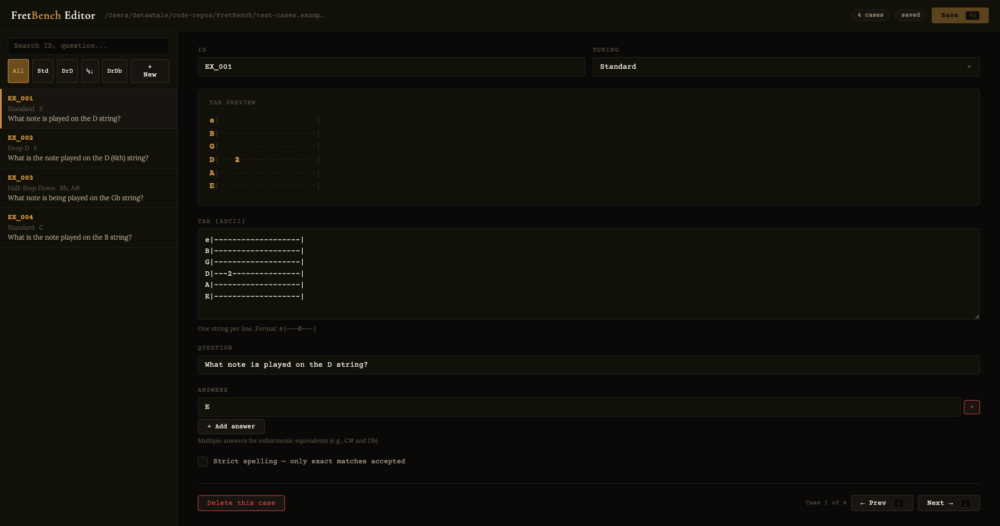

# FretBench

A benchmark for evaluating how well LLMs can read guitar tablature and reason about the fretboard.

**182 test cases** across 4 tunings, covering single-note identification, melody traversal, temporal ordering, and more.

[View results at fretbench.tymo.ai](https://fretbench.tymo.ai)

## How it works

Each test case presents a model with an ASCII guitar tab and a natural-language question like:

- *"What note is played on the G string?"*
- *"What is the 3rd note played?"*
- *"What note comes after the D?"*
- *"What is the last note played on the A string?"*

The model must return just the note name (e.g. `F#`). Answers are graded against a list of acceptable spellings, with enharmonic equivalents accepted by default.

## Quick start

### Prerequisites

- Node.js 18+
- [pnpm](https://pnpm.io)
- An [OpenRouter](https://openrouter.ai) API key

### Install

```bash
cd cli
pnpm install
```

### Configure

```bash
cp .env.example .env
# Edit .env and add your OPENROUTER_API_KEY
```

### Run the benchmark

```bash
# Cost estimate first
npx tsx src/index.ts run --all --dry-run

# Single model
npx tsx src/index.ts run deepseek/deepseek-v3.2

# All enabled models
npx tsx src/index.ts run --all

# By tier
npx tsx src/index.ts run --tier flagship
npx tsx src/index.ts run --tier mid
```

### View results

```bash
# Leaderboard in terminal
npx tsx src/index.ts leaderboard

# Detailed stats for one model
npx tsx src/index.ts stats deepseek/deepseek-v3.2

# Export to website JSON + build
npx tsx src/index.ts export
cd ../website && pnpm build
```

## Test cases

Test cases live in `test-cases.json` at the repo root. This file is **gitignored** — it contains the real benchmark data and is not distributed publicly.

`test-cases.examples.json` is tracked and shows the expected format with 4 dummy cases.

### Schema

Each item has:

| Field | Type | Description |
|---|---|---|
| `id` | string | Unique identifier, e.g. `FB_001` |
| `tuning` | string | `Standard`, `Drop D`, `Half-Step Down`, or `Drop Db` |
| `tab` | string | ASCII tablature (newlines as `\n`) |
| `question` | string | Natural-language question about the tab |
| `answers` | string[] | Acceptable note names (enharmonic equivalents included) |
| `strict_spelling` | boolean? | When `true`, only exact spellings in `answers` are accepted |

### Grading

- **Normal questions**: correct if the model's response matches any entry in `answers` (case-insensitive, whitespace-normalized).
- **Strict-spelling questions**: only the exact spellings listed in `answers` count.

### Bring your own test cases

You can run the benchmark against any JSON file matching the schema above:

```bash
npx tsx src/index.ts run deepseek/deepseek-v3.2 --dataset ./my-cases.json --dataset-name "my-suite"
```

Results are stored separately per dataset name in the local SQLite database.

## Test case editor

A local visual editor for browsing, creating, and editing test cases.



### Run it

```bash
npx tsx tools/editor.ts
# Opens at http://localhost:3333
```

Options:

```
--file <path>   Path to test cases JSON (default: ./test-cases.json)
--port <n>      Port number (default: 3333)
```

Features:
- Sidebar with search and tuning filters
- Live tab preview with colorized string names and fret numbers
- Edit ID, tuning, tab, question, answers, and strict_spelling
- Dirty-state tracking with unsaved indicators
- Keyboard shortcuts: `Cmd+S` save, `↑/↓` or `j/k` navigate, `n` new case

## Test case generator

Generate diverse test cases programmatically:

```bash
# Preview what would be generated
npx tsx tools/generate-cases.ts

# Merge into existing test-cases.json
npx tsx tools/generate-cases.ts --merge

# Write to a separate file
npx tsx tools/generate-cases.ts --out new-cases.json
```

The generator covers 6 question categories: melody-on-string, last-note, arpeggio, first/last-note-overall, riffs with hammer-ons/slides, and note-after questions. It includes built-in validation to catch simultaneous-note counting issues.

## Models

Models are defined in `cli/models.yaml`. The current registry:

**Flagship**: GPT-5.4, Claude Opus 4.6, Claude Sonnet 4.6, Gemini 3.1 Pro, DeepSeek V3.2, Qwen 3.5 Plus, Mistral Large, Llama 4 Scout

**Mid-tier**: Claude Haiku 4.5, Gemini 3.1 Flash Lite, Qwen 3.5 Flash, DeepSeek V3.2 Speciale, Llama 3.3 70B

**Small**: Ministral 8B, Nemotron 3 Nano (disabled by default)

All models are accessed via OpenRouter. Edit `models.yaml` to enable/disable models or add new ones.

## Project structure

```
FretBench/
├── cli/                        # Benchmark CLI
│   ├── src/
│   │   ├── index.ts            # CLI entry point (commander)
│   │   ├── runner.ts           # Test runner + orchestration
│   │   ├── grader.ts           # Answer grading (enharmonics, normalization)
│   │   ├── eval-version.ts     # System prompt + eval config versioning
│   │   ├── openrouter.ts       # OpenRouter API client
│   │   ├── db.ts               # SQLite schema + queries
│   │   ├── stats.ts            # Leaderboard, stats, export
│   │   ├── models.ts           # Model registry loader
│   │   └── cost.ts             # Cost estimation
│   ├── models.yaml             # Model definitions
│   └── .env                    # API key (gitignored)
├── tools/
│   ├── editor.ts               # Local test case editor server
│   ├── editor.html             # Editor UI
│   └── generate-cases.ts       # Test case generator
├── website/                    # Astro site (fretbench.tymo.ai)
│   └── src/
│       ├── pages/
│       │   ├── index.astro     # Homepage with leaderboard
│       │   └── results.astro   # Full results page
│       └── data/
│           ├── results.json    # Exported benchmark data
│           └── loadResults.ts  # Typed data accessors
├── test-cases.json             # Real test cases (gitignored)
├── test-cases.examples.json    # Format examples (tracked)
└── data/
    └── fretbench.db            # Local SQLite database (gitignored)
```

## Website

The results site at [fretbench.tymo.ai](https://fretbench.tymo.ai) is built with Astro. To publish updated results:

```bash
cd cli
npx tsx src/index.ts export    # DB → website/src/data/results.json
cd ../website
pnpm build                      # Static build
```

## License

MIT
