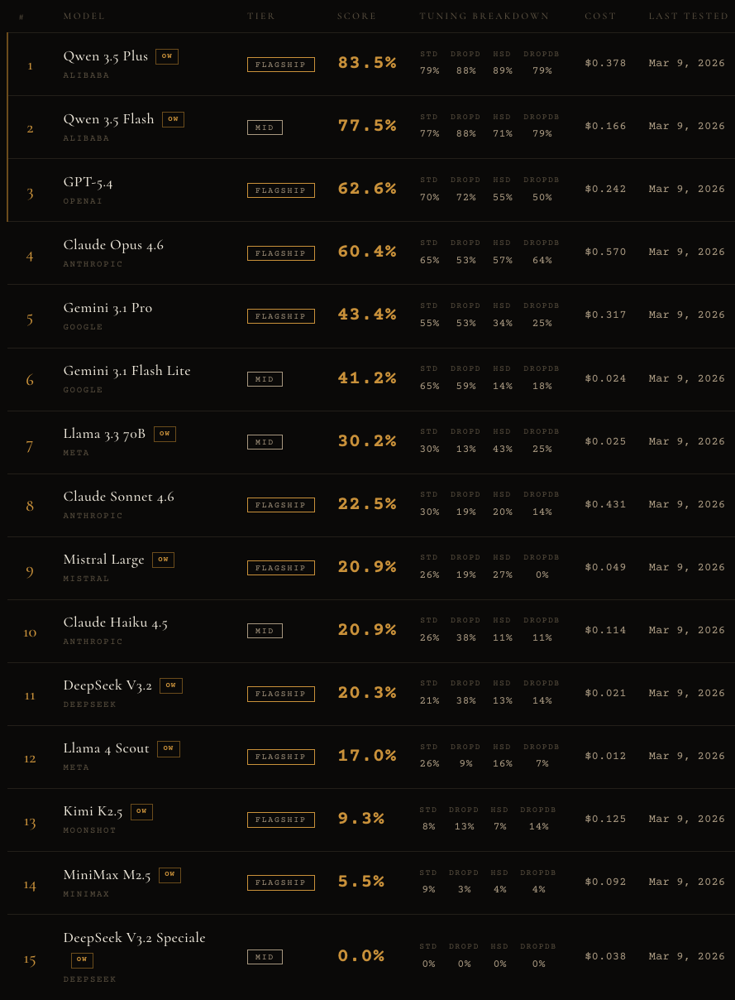
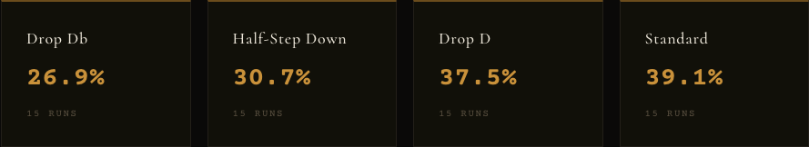

> **Correction (Mar 10, 2026):** A grading bug in the eval pipeline silently dropped sharp notes from extracted answers, significantly undercounting scores for most models. Two test cases also had incorrect answers. The corrected results tell a very different story — [read the updated analysis](/blog/corrected-results-open-weight-models-dominate-fretbench/).

I was messing around with Gemini the other day, asking it to help me with some guitar stuff. Tab analysis, fretboard questions, that kind of thing. And it was *terrible*. Not "sort of wrong" — confidently, consistently wrong about basic fretboard mechanics.

So I got curious. Is this a Gemini thing, or an LLM thing?

## What is guitar tablature?

If you've never played guitar, tablature (tab) is probably the simplest notation system in all of music. Six lines, one per string. Numbers tell you which fret to press. Read left to right. That's it.

Here's an example:

```
e|--0---3---5---7---5---3-----|
B|----------------------------|
G|----------------------------|
D|----------------------------|
A|----------------------------|
E|----------------------------|
```

The `0` on the high E string means play it open (E). The `3` means third fret (G). The `5` means fifth fret (A). And so on. A guitarist picks this up in about ten minutes. There's no ambiguity. It's pure pattern matching with a lookup table.

The only twist is tuning. In standard tuning, the strings are E-A-D-G-B-E from low to high. Drop the low E to D and you're in Drop D. Tune everything down a half step and you're in Half-Step Down. The rules don't change — the starting pitches do. You're still just counting semitones up from the open string.

## The benchmark

I built [FretBench](https://github.com/jmcapra/FretBench) — 182 test cases across four tunings (Standard, Drop D, Half-Step Down, Drop Db). Each case presents a model with an ASCII tab, the tuning, and a question. The model has to return just the note name.

The questions aren't trick questions. They're things like:

- "What note is played on the G string?"
- "What is the 3rd note played on the e string?"
- "What note comes after the D?"
- "What is the last note played?"

The system prompt gives the model everything it needs: the chromatic scale, the tuning reference, and clear instructions on how to read tab. The context window is almost empty. There's nothing to get confused about — or so I thought.

## The results



### Qwen dominates

The two Qwen 3.5 models from Alibaba are in a completely different league. Qwen 3.5 Plus scored **83.5%** and Qwen 3.5 Flash scored **77.5%**. The next closest model, GPT-5.4, is 20 points behind at 62.6%.

Both Qwen models are open weight. Both are classified as different tiers — Plus is flagship, Flash is mid-range. And Flash still beat every single closed-source flagship model on the leaderboard.

I genuinely don't know why the Qwen models are so much better at this. My best guess is that it has something to do with how different models tokenize ASCII characters — the pipes, dashes, and fret numbers that make up tab notation. If one tokenizer chunks `|---3---|` into sensible semantic units and another splits it into meaningless fragments, the downstream reasoning will be fundamentally different. I haven't confirmed this yet, but it's the most plausible explanation for a 20+ point gap on what is essentially a pattern-matching task.

### The middle of the pack

GPT-5.4 and Claude Opus 4.6 come in at 62.6% and 60.4% respectively — respectable, but not great for a task with clear rules and minimal context. Gemini 3.1 Pro sits at 43.4%, which tracks with my original experience. It's better than I expected, honestly.

An interesting detail: Gemini 3.1 Flash Lite (a mid-tier model) scores 41.2% — nearly matching its bigger sibling while costing a fraction of the price. The full Gemini Pro model isn't giving you much extra for this kind of structured reasoning task.

### The bottom falls out

Then there's the bottom of the leaderboard. Claude Sonnet 4.6 — Anthropic's flagship that most people actually use day-to-day — scores 22.5%. Mistral Large and Claude Haiku are around 21%. DeepSeek V3.2 at 20.3%.

These are all "flagship" or popular mid-tier models scoring at or near random chance. For reference, if you guessed randomly across 12 possible note names, you'd expect to get about 8.3% right.

And then there's MiniMax M2.5 at 5.5% and DeepSeek V3.2 Speciale at a flat 0%. MiniMax literally performed worse than rolling dice.

### Tuning matters



Standard tuning is the easiest at 39.1% average across all models. Drop Db is the hardest at 26.9%. This makes sense — Drop Db requires the model to track that both the low and high strings are tuned down differently, and the string labels use flats (Db, Ab, Gb, etc).

But here's where it gets weird. GPT-5.4 scores *higher* on Drop D (72%) than on Standard (70%). The Qwen models score 88% on Drop D — their best tuning. You'd expect non-standard tunings to be harder, but for the top models, Drop D is apparently easier. My theory: Drop D only changes one string, so the model has less to track. The simpler deviation from standard actually helps focus attention.

Half-Step Down is where most models fall apart. Everything shifts by one semitone and all the string labels change to flats. For models already struggling with the basic task, that extra layer of indirection is fatal.

## What this actually tests

FretBench isn't really a music benchmark. It's a test of whether a model can:

1. **Parse structured ASCII input** — read a 6-line grid of characters and understand the spatial relationships
2. **Follow explicit rules** — the system prompt tells you exactly how tab works, exactly what the tunings are, and gives you the full chromatic scale
3. **Perform simple arithmetic** — count N semitones up from a known starting note
4. **Track temporal ordering** — figure out that notes played at the same horizontal position are simultaneous, and count "the 3rd note played" correctly

None of these are hard individually. Together they form a basic reasoning chain that most models can't reliably execute. The context window is nearly empty. There's no ambiguity in the instructions. And yet 10 out of 15 models score below 50%.

## What's next

I'm planning to run more models as they become available through OpenRouter. I'm also digging into the tokenization hypothesis — if I can confirm that the performance gap correlates with how different tokenizers handle ASCII art, that would be a genuinely useful finding for anyone building structured-input benchmarks.

The full results are live at [fretbench.tymo.ai/results](https://fretbench.tymo.ai/results). The benchmark, CLI, test case editor, and website are all open source on [GitHub](https://github.com/jmcapra/FretBench). If you want to run it against your own models or build your own test cases, the whole thing is designed for that.

If you want to follow along as I add more models and dig into the tokenization question, I'm on [X/Twitter](https://x.com/JaidenCapra).
